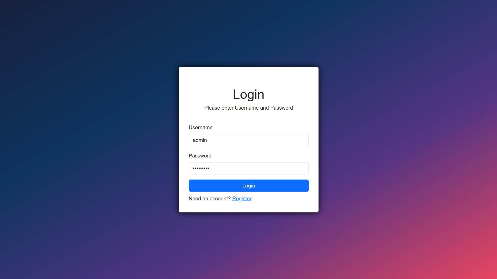

[![LinkedIn][linkedin-shield]][linkedin-url]
[![Apache License][license-shield]][license-url]
[![X][X-sheild]][X-url]


<p align="center">
  <a href="#video-">View Video</a>
    ·
  <a href="https://github.com/Elio-Aliaj/Hotel-Project/issues">Report Bug</a>
    ·
  <a href="https://github.com/Elio-Aliaj/Hotel-Project/issues">Request Feature</a>
</p>

<details>
  <summary>Table of Contents 📋</summary>
  <ol>
    <li>
      <a href="#hotel-booking-website-">Hotel Booking Website 🔰</a>
      <ul>
        <li><a href="#key-features-%EF%B8%8F">Key Features 🔑</a></li>
        <ul>
          <li><a href="#admin-privileges-">Admin Privileges 🔐</a></li>
        </ul> 
        <li><a href="#tech-stack-">Tech Stack 🧰</a></li>
          <ul>
            <li><a href="#frontend-%EF%B8%8F">Frontend 🖥️</a></li>
            <li><a href="#backend-">Backend 🦾</a></li>
            <li><a href="#database-%EF%B8%8F">Database 🗃️</a></li>
          </ul>
      </ul>
    </li>
    <li>
      <a href="#getting-started-">Getting Started 🏁</a>
      <ul>
        <li><a href="#prerequisites-">Prerequisites 📦</a></li>
        <li><a href="#installation-%EF%B8%8F">Installation ⬇️</a></li>
        <li><a href="#running--configuration-">Running & Configuration 🚀</a>
          <ul>
        <li><a href="#configuration-%EF%B8%8F">Configuration ⚙️</a>
        <li><a href="#running-%EF%B8%8F">Running 🏃‍♂️</a>
          </ul>
        </li>
      </ul>
    </li>
    <li><a href="#usage-%EF%B8%8F">Usage 🛠️</a>
      <ul>
        <li><a href="#video-">View Video 🎬</a></li>
        <li><a href="#screenshot-">Screenshot 📸</a></li>
      </ul>
    </li>
    <li><a href="#license-">License 🪪</a></li>
    <li><a href="#contact-">Contact 📞</a></li>
  </ol>
</details>

###

###

# Hotel Booking Website 🔰

Welcome to the Hotel Booking Website project! This web application is designed to streamline hotel room booking processes with a user-friendly interface. Users can register, log in, explore available rooms, and make reservations based on their preferred dates.


## Key Features 🗝️

- **User Registration and Authentication:** Users can create accounts and log in securely to access the booking features.

- **Room Listings:** A comprehensive display of all available rooms with details such as room type, space, and pricing.

- **Booking Functionality:** Users can book a room if it's available on the selected date, providing a hassle-free reservation experience.

- **Admin Dashboard:** An administrative interface allows admins to manage rooms, bookings, and users efficiently.

- **Room Management:** Admins can add, edit, or remove rooms, including the option to upload photos to enhance room descriptions.

- **Booking Management:** View and manipulate all booking details, giving admins control over reservations.

- **User Management:** Admins can oversee user accounts, with the ability to edit or delete accounts and grant or revoke admin privileges.

### Admin Privileges 🔐

Admins have additional responsibilities and privileges:

- Add/Edit/Remove Rooms: Admins can update the list of available rooms, edit their details, or remove them as needed.

- Booking Oversight: Complete view and control over all bookings, including the ability to edit or delete reservations.

- User Management: Admins can manage user accounts, edit details, and control admin privileges.

## Tech Stack 🧰

### Frontend 🖥️:

- [![HTML5][HTML5-sheild]][HTML5-url]
- [![CSS3][CSS3-sheild]][CSS3-url]
- [![AngularJs][AngularJs-sheild]][AngularJs-url]
- [![TypeScript][TypeScript-sheild]][TypeScript-url]
- [![BootStrap][Bootstrap-sheild]][Bootstrap-url]

### Backend 🦾:

- [![NodeJs][NodeJs-sheild]][NodeJs-url]
- [![JavaScript][JavaScript-sheild]][JavaScript-url]

### Database 🗃️:

- [![MySql][MySql-sheild]][MySql-url]

## Getting Started 🏁

### Prerequisites 📦

Before getting started, ensure you have the necessary prerequisites:

- **Node.js:** Make sure you have Node.js installed. If not, you can download and install it from [Node.js](https://nodejs.org/en)

- **MySQL** Make sure you have Node.js installed. Visit [MySQL](https://www.mysql.com/) to install the database server.

### Installation ⬇️

1. Clone the repository

   ```bash
   git clone https://github.com/Elio-Aliaj/Hotel-Project.git
   ```

2. Install packages

   ```powershell
   cd .\Hotel-Booking-Website\Backend
   ```

   ```powershell
   npm install
   ```

   ```powershell
   cd .\Hotel-Booking-Website\Frontend
   ```

   ```powershell
   npm install
   ```

### Running & Configuration 🚀

#### Configuration ⚙️

1. In the project folder (bHotel-Booking-Website\Backend), locate the `.env.example` file
2. Rename it to `.env`
3. Open the `.env` file:
   - Replace `MYSQL_HOST` with your actual database IP.
   - Replace `MYSQL_USER` with your actual database User.
   - Replace `MYSQL_PASSWORD` with your database Password for the User.
   - Replace `MYSQL_DATABASE` with your actual database Name.
   - Replace `AUTH_KEY` with your encoder key.

_I am assuming that you know how to set up your database if not this [video](https://www.youtube.com/watch?v=u96rVINbAUI) might be helpful._

4. To create the tables on the database you can run the query in this file - [Database Tables](./Database%20Tabels.sql)

#### Running 🏃‍♂️

1.  Run Frontend server

    ```powershell
    cd .\Hotel-Booking-Website\Frontend
    ```

    ```powershell
    npm start
    ```

    <details>
    <summary>
    This will be shown in the console:
    </summary>
      <code>

        > frontend@0.0.0 start
        > ng serve

        Initial Chunk Files | Names         |  Raw Size
        styles.css          | styles        | 271.49 kB |
        main.js             | main          | 100.19 kB |
        polyfills.js        | polyfills     |  82.71 kB |

                            | Initial Total | 454.38 kB

        Application bundle generation complete. [2.610 seconds]
        Watch mode enabled. Watching for file changes...
        ➜  Local:   http://localhost:4200/

        No output file changes.

        Unchanged output files: 3
        Application bundle generation complete. [0.281 seconds]

    </code>
    </details>

2.  Run Frontend server

    ```powershell
    cd .\Hotel-Booking-Website\Backend
    ```

    ```powershell
    node .\App.js
    ```

    <details>
    <summary>
    This will be shown in the console:
    </summary>
    <code>

        -----------------:: Service listening on port: 3000 ::-----------------

    </code>
    </details>

3.  Now you can access the frontend server in the browser in the link: [http://localhost:4200/](http://localhost:4200/)

    - To login as admin:
      - **Username:** admin
      - **Password:** Admin123@
    - You can register new users and give that user from the admin account admin privileges

## Usage 🛠️

### Video 🎬

https://github.com/Elio-Aliaj/Hotel-Booking-Website/assets/119447071/547d1e49-8e07-4ae7-8814-d1f919a1a62e

### Screenshot 📸

<details>
<summary>
Here are some examples:
</summary>




</details>

## License 🪪

[![Apache License][license-shield]][license-url]

©️ Copyright 2024 Elio Aliaj <elio.aliaj0@gmail.com>

Licensed under the Apache License, Version 2.0 (the "License");
you may not use this file except in compliance with the License.
You may obtain a copy of the License at

http://www.apache.org/licenses/LICENSE-2.0

Unless required by applicable law or agreed to in writing, software
distributed under the License is distributed on an "AS IS" BASIS,
WITHOUT WARRANTIES OR CONDITIONS OF ANY KIND, either express or implied.
See the License for the specific language governing permissions and
limitations under the License.

## Contact 📞

[![Gmail][Gmail-sheild]][Gmail-url]
[![LinkedIn][linkedin-shield]][linkedin-url]
[![X][X-sheild]][X-url]
[![GitHub][GitHub-sheild]][GitHub-url]

<!-- Links & Logos -->

[linkedin-shield]: https://img.shields.io/badge/LinkedIn-%230A66C2?style=for-the-badge&logo=linkedin
[linkedin-url]: https://www.linkedin.com/in/elio-aliaj-48084a255/
[license-shield]: https://img.shields.io/github/license/Elio-Aliaj/Automated-Website-and-CMS?style=for-the-badge&logo=Apache&logoColor=%23D22128&color=%23D22128
[license-url]: https://github.com/Elio-Aliaj/Hotel-Booking-Website/blob/main/LICENSE
[X-sheild]: https://img.shields.io/badge/Elio%20Aliaj-%23000000?style=for-the-badge&logo=x&labelColor=%23000000
[X-url]: https://twitter.com/Elio_Aliaj
[HTML5-sheild]: https://img.shields.io/badge/HTML5-E34F26?style=for-the-badge&logo=html5&logoColor=%23fff
[HTML5-url]: https://en.wikipedia.org/wiki/HTML5
[CSS3-sheild]: https://img.shields.io/badge/CSS3-1572B6?style=for-the-badge&logo=CSS3
[CSS3-url]: https://css3.com/
[JavaScript-sheild]: https://img.shields.io/badge/Javascript-F7DF1E?style=for-the-badge&logo=javascript&logoColor=%23fff
[JavaScript-url]: https://www.javascript.com/
[NodeJs-sheild]: https://img.shields.io/badge/Node.js-339933?style=for-the-badge&logo=nodedotjs&logoColor=%23fff
[NodeJs-url]: https://nodejs.org/en
[TypeScript-sheild]: https://img.shields.io/badge/TypeScript-3178c6?style=for-the-badge&logo=typescript&logoColor=fff
[TypeScript-url]: https://www.typescriptlang.org/
[AngularJs-sheild]: https://img.shields.io/badge/angular-dd0031?style=for-the-badge&logo=angular&logoColor=fff
[AngularJs-url]: https://angular.io/
[MySql-sheild]: https://img.shields.io/badge/MySQL-f29111?style=for-the-badge&logo=mysql&logoColor=fff
[MySql-url]: https://www.mysql.com/
[Bootstrap-sheild]: https://img.shields.io/badge/Bootstrap-6d2cf1?style=for-the-badge&logo=Bootstrap&logoColor=fff
[Bootstrap-url]: https://getbootstrap.com/
[Gmail-sheild]: https://img.shields.io/badge/Gmail-%23EA4335?style=for-the-badge&logo=gmail&labelColor=%23fff
[Gmail-url]: mailto:elioaliaj0@gmail.com
[GitHub-sheild]: https://img.shields.io/badge/GitHub-%23181717?style=for-the-badge&logo=github
[GitHub-url]: https://github.com/Elio-Aliaj
